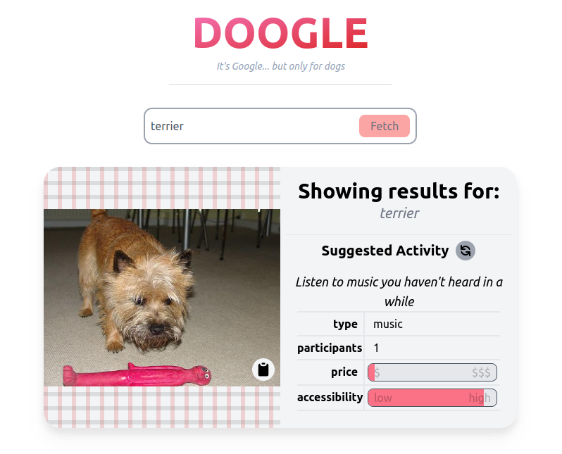

# Doogle
<p align="center">
  
</p>
Doogle is the first dog centric search engine that provides random dog photos based on breed. Additionally, it suggests fun activities for you to do as you clearly must be a little bored if you're looking up random dog photos on the internet.
<br>
I had lots of fun working on this assignment, and look forward to hearing back!

## Technologies/Concepts used (in no particular order)
- React: I utilized React for the front end of this web application. I enjoy the ability to concentrate all portions of web design and development inside one language and file type. I'm quite comfortable working with JSX and React components + state changing and event handling.
- TailwindCSS: I used TailwindCSS for styling components on the frontend. Unlike CSS frameworks like Bootstrap, Tailwind's functional classes allow me to quickly design a fairly comprehensive UI.
- Websockets: Although not necessary, I utilized koa-websocket to create a websocket address the application connects to for sending real time recommendations as the user types into the search bar.
- supertest: The testing library used for testing the backend.

## Starting it up! (READ ME!!!)
For convenience sake, I've added a bash script called 'run.sh' which will run through the build and deploy process.
```sh
sh run.sh
```
Afterwards, the site should be live on http://localhost:3011/

If for some reason this automated script fails, follow the instructions below:<br>

First step is to create a production build of the React app.<br>
Starting from the project's root:
```sh
cd frontend
npm install
npm run build .
```

Once the build has completed, the koa backend will serve the rest.<br>
Starting from the project's root:
```sh
npm install
node index.js
```

The site and API should now be live on http://localhost:3011<br>
The site lives on http://localhost:3011/ and api on http://localhost:3011/api/

### Testing library
I use mocha for running test.js. You'll need to install this module and then run the test script
specifically through mocha.
```sh
npm install mocha -g
mocha test.js
```

Or you can use the npm command:
```sh
npm run test
```

# FROM ORIGINAL README.md
This is the starter code for a [Node.js](https://nodejs.org/en/about/) server
using the [Koa web framework](https://koajs.com/). There a web page in
`/public` which should be served to the user.

## Getting started

You will need to install Node.js.

For best results, use [**Node.js >= 16**](https://nodejs.org/).


You can check your current version of Node.js like this:

```sh
$ node --version
v16.13.1
```

Then, inside this project, run

```sh
npm install
node index.js
```

If the server starts successfully, you will see

```sh
Server running on http://localhost:3011
```

## Documentation

- Koa: https://koajs.com/
- @koa/router: https://github.com/koajs/router#koarouter
- koa-body: https://github.com/dlau/koa-body#usage-with-koa-router
- Dogs API: https://dog.ceo/dog-api/breeds-list
- Bored API: https://www.boredapi.com/
